# Architecture

This diagram is checked by `tests/architecture-diagram.test.js`. Every solid
arrow must be a real `import`, every dotted arrow must be a real *non*-import,
and every module named here must exist. A wrong arrow fails the suite.

## The shape of the app

One core renders the page. Twenty-five independent modules watch what it
rendered and change it. **The core does not know they exist**, and that is the
single most important thing to understand here: `app.js` imports none of them,
and every arrow into it points the wrong way if you draw it as a call graph.

```mermaid
graph TD
  player((Player))

  subgraph core["Core render — owns #app"]
    app_js["Application Shell<br/>app.js"]
    setups_js["Setups model<br/>setups.js"]
    item_catalog_js["Item catalog<br/>item-catalog.js"]
    backup_js["Backup contract<br/>backup.js"]
    progression_js["Progression stages<br/>progression.js"]
    computed_stats_js["Computed stats<br/>computed-stats.js"]
    data_js["Farming data<br/>data.js"]
  end

  subgraph enhance["Enhancement layer — 25 MutationObserver modules over #app"]
    revenue_planner_js["Revenue planner<br/>revenue-planner.js"]
    planner_mode_ui_js["Planner modes<br/>planner-mode-ui.js"]
    pests_page_js["Pests page<br/>pests-page.js"]
    foundation_js["Sync + backup UI<br/>foundation.js"]
    skyblock_redesign_js["Redesign shell<br/>skyblock-redesign.js"]
    item_art_coverage_js["Item art<br/>item-art-coverage.js"]
    phase_loadout_guide_js["Phase loadouts<br/>phase-loadout-guide.js"]
  end

  subgraph money["Cost and profit"]
    upgrade_cost_resolution_js["Cost precedence<br/>upgrade-cost-resolution.js"]
    upgrade_costs_js["Researched costs<br/>upgrade-costs.js"]
    measured_baseline_js["Measured baseline<br/>measured-baseline.js"]
    planner_profit_adapter_js["Profit adapter<br/>planner-profit-adapter.js"]
    profit_engine_js["Profit engine<br/>profit-engine.js"]
    live_crop_price_js["Crop price<br/>live-crop-price.js"]
    live_prices_js["Bazaar model<br/>live-prices.js"]
    live_price_refresh_js["Price refresher<br/>live-price-refresh.js"]
  end

  subgraph models["Mechanics models"]
    planner_activity_context_js["Activity context<br/>planner-activity-context.js"]
    farming_mechanics_data_js["Crop models<br/>farming-mechanics-data.js"]
    contest_estimate_js["Contest estimate<br/>contest-estimate.js"]
    jacob_contest_model_js["Jacob contests<br/>jacob-contest-model.js"]
    pest_model_js["Pest page model<br/>pest-model.js"]
    pest_mechanics_data_js["Pest mechanics<br/>pest-mechanics-data.js"]
    activity_mode_js["Activity phases<br/>activity-mode.js"]
  end

  subgraph sync["Profile synchronisation"]
    live_sync_js["Sync orchestrator<br/>live-sync.js"]
    hypixel_client_js["API client<br/>hypixel-client.js"]
    profile_sync_js["Profile sync<br/>profile-sync.js"]
    profile_items_js["Item importer<br/>profile-items.js"]
    item_normalizer_js["Item normalizer<br/>item-normalizer.js"]
    nbt_js["NBT decoder<br/>nbt.js"]
    profile_normalizer_js["Profile normalizer<br/>profile-normalizer.js"]
  end

  ext_hypixel[["api.hypixel.net"]]
  ext_textures[["textures.minecraft.net"]]
  ext_pack[["assets/hypixel-pack"]]

  player --> app_js

  app_js --> setups_js
  app_js --> item_catalog_js
  app_js --> backup_js
  app_js --> progression_js
  app_js --> computed_stats_js
  computed_stats_js --> data_js

  revenue_planner_js -.-> app_js
  planner_mode_ui_js -.-> app_js
  pests_page_js -.-> app_js
  foundation_js -.-> app_js
  skyblock_redesign_js -.-> app_js
  item_art_coverage_js -.-> app_js
  phase_loadout_guide_js -.-> app_js

  revenue_planner_js --> upgrade_cost_resolution_js
  revenue_planner_js --> measured_baseline_js
  revenue_planner_js --> live_crop_price_js
  revenue_planner_js --> planner_activity_context_js
  upgrade_cost_resolution_js --> upgrade_costs_js
  measured_baseline_js --> planner_profit_adapter_js
  measured_baseline_js --> farming_mechanics_data_js
  planner_profit_adapter_js --> profit_engine_js
  planner_profit_adapter_js --> farming_mechanics_data_js
  live_crop_price_js --> live_prices_js
  live_crop_price_js --> farming_mechanics_data_js
  live_price_refresh_js --> live_prices_js
  live_price_refresh_js -.-> live_crop_price_js
  planner_activity_context_js --> computed_stats_js

  planner_mode_ui_js --> contest_estimate_js
  contest_estimate_js --> jacob_contest_model_js
  pests_page_js --> pest_model_js
  pest_model_js --> pest_mechanics_data_js
  phase_loadout_guide_js --> activity_mode_js

  foundation_js --> live_sync_js
  live_sync_js --> hypixel_client_js
  live_sync_js --> profile_sync_js
  profile_sync_js --> profile_items_js
  profile_sync_js --> profile_normalizer_js
  profile_items_js --> item_normalizer_js
  item_normalizer_js --> nbt_js

  hypixel_client_js ==> ext_hypixel
  live_price_refresh_js ==> ext_hypixel
  item_catalog_js ==> ext_hypixel
  item_art_coverage_js ==> ext_textures
  item_art_coverage_js ==> ext_pack
```

**Solid** is an import. **Dotted** is a relationship that is deliberately not
one. **Thick** is a network or asset fetch.

## The three dotted arrows, and why they matter

**Enhancement → `app.js`.** Twenty-four modules observe `#app` with a
`MutationObserver` and patch what the core rendered. `app.js` imports none of
them and would render the same page if every one were deleted. Drawing this as
`app.js → planner` inverts the dependency and hides the reason
`docs/RENDER_FREEZE_SAFETY.md` exists at all: an enhancer that is not
idempotent freezes the whole app, because it wakes itself up.

**`live-price-refresh.js` ⇢ `live-crop-price.js`.** They never import each
other. One fetches the Bazaar and writes a cached snapshot; the other reads that
cache when the planner asks. The handoff is `localStorage`, deliberately, so a
failed fetch degrades to "no live price" instead of breaking the planner.

**`upgrade-costs.js`** is generated by `scripts/build-upgrade-costs.py` from the
JSON under `research/`. It is not hand-edited, and the generator refuses to
build if it names an upgrade id that `data.js` does not have.

## What is deliberately absent

- **No "Bazaar service".** The Bazaar is `api.hypixel.net/v2/skyblock/bazaar` —
  the same host as everything else, reached by `live-price-refresh.js` with a
  plain `fetch`, not through the API client.
- **`hypixel-client.js` is only reached through `live-sync.js`**, which
  `foundation.js` owns. `profile-sync.js` never calls the network; it is handed
  payloads.
- **`nbt.js` is two hops down**, behind `item-normalizer.js`, not directly under
  the item importer.

## Corrections this diagram makes

An earlier hand-drawn version had 12 of its 20 edges wrong. The ones worth
naming, because each is a different kind of mistake:

| Claimed | Actually |
|---|---|
| `app.js → revenue-planner.js` | reversed — the planner observes the core |
| `app.js → profile-sync.js` | `foundation.js → live-sync.js → profile-sync.js` |
| `profile-sync.js → hypixel-client.js` | reversed — `live-sync.js` owns the client |
| `profit adapter → live price refresh` | no link; the adapter knows nothing about prices |
| `profit adapter → computed stats` | reached via `planner-activity-context.js` |
| `profit adapter → pest model` | no link; the pests page owns that model |
| `revenue planner → progression.js` | no link; `app.js` and `dashboard-guide.js` use it |
| `revenue planner → profit adapter` | one hop missing: `measured-baseline.js` |
| `profile-items.js → nbt.js` | one hop missing: `item-normalizer.js` |
| `live price refresh → hypixel client` | it calls `fetch` directly |
| `Bazaar Service` as its own system | it is a path on `api.hypixel.net` |
| `app.js → app.js` ("renders") | a box pointing at itself |

The cost table, the measured baseline, the planner modes and the resource pack
were missing entirely.
